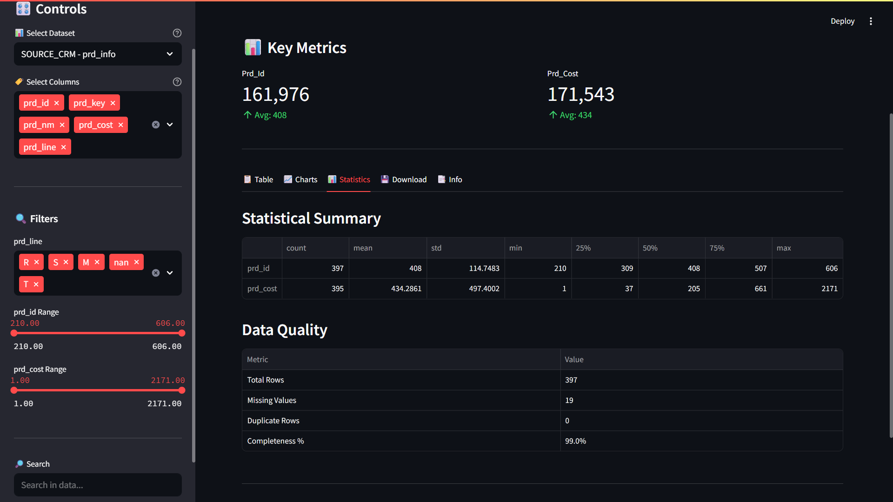

# 📊 SQL Data Warehouse – ETL & Analytics Platform

A production-ready data warehouse solution combining SQL Server backend with a Python Streamlit analytics dashboard. Processes CRM and ERP data through a 3-tier architecture (Bronze → Silver → Gold) with built-in data quality validation.

## 🏗️ Architecture

```
┌─────────────────────────────────────────┐
│   Source Systems (CRM & ERP)           │
│   • Customer Info      • Product Catalog│
│   • Sales Details      • Master Data    │
└────────────┬────────────────────────────┘
             ↓
┌─────────────────────────────────────────┐
│   Bronze Layer (Raw)                    │
│   Raw data ingestion with minimal prep  │
└────────────┬────────────────────────────┘
             ↓
┌─────────────────────────────────────────┐
│   Silver Layer (Cleaned)                │
│   Deduplication, validation, standards  │
└────────────┬────────────────────────────┘
             ↓
┌─────────────────────────────────────────┐
│   Gold Layer (Analytics)                │
│   Dimension & fact tables for reporting │
└────────────┬────────────────────────────┘
             ↓
┌─────────────────────────────────────────┐
│   Streamlit Dashboard (Interactive)     │
│   Charts, filters, KPIs, data export    │
└─────────────────────────────────────────┘
```

## 📁 Project Structure

```
├── scripts/                           # SQL warehouse automation
│   ├── init_database.sql             # Database & schema setup
│   ├── bronze-layer/                 # Raw data DDL & load procedures
│   ├── silver-layer/                 # Transform & clean logic
│   └── gold_layer/                   # Analytics layer tables
├── data_transformations/             # ETL transformation queries (6 files)
├── tests/quality_checks_silver.sql   # Data validation suite
├── datasets/                         # Source data
│   ├── source_crm/                  # 3 CRM CSV files
│   └── source_erp/                  # 3 ERP CSV files
├── app.py                           # Streamlit dashboard
├── requirements.txt                 # Python dependencies
└── docs/                            # Naming conventions & catalog
```

## Dashboard Overview



## 📊 Data Sources

**CRM System**: Customer information, products, sales transactions
- `cust_info.csv` – Customer master data
- `prd_info.csv` – Product catalog
- `sales_details.csv` – Transaction records

**ERP System**: Master data and hierarchies
- `CUST_AZ12.csv` – ERP customer records
- `LOC_A101.csv` – Location master
- `PX_CAT_G1V2.csv` – Product categories

## 🔄 ETL/ELT Workflow

1. **Data Ingestion**: CSV files loaded to Bronze layer as raw copies
2. **Transformation**: 6 SQL transformation scripts handle Bronze → Silver conversion
   - Customer deduplication & standardization
   - Product data normalization
   - Sales detail enrichment
3. **Quality Validation**: SQL checks verify data integrity in Silver layer
4. **Analytics**: Gold layer aggregates data for reporting
5. **Dashboard**: Streamlit app queries transformed data for visualization

# Run dashboard
streamlit run app.py
```

Open `http://localhost:8501` in your browser.

## 📊 Data Sources

- **source_crm/**: Customer info, product details, sales transactions
- **source_erp/**: ERP customer data, locations, product categories

## 🛠️ Technologies

- **Backend**: Python, SQL Server
- **Frontend**: Streamlit
- **Data**: Pandas, NumPy
- **Visualization**: Plotly

## 📈 Future Enhancements

- Real-time data refresh
- Advanced analytics (forecasting, clustering)
- Database connectivity  
- User authentication
- Performance dashboards

## 📝 License

MIT License

---

**Built for**: Resume • Portfolio • Data Engineering Interviews  
**Last Updated**: 2026-06-14
